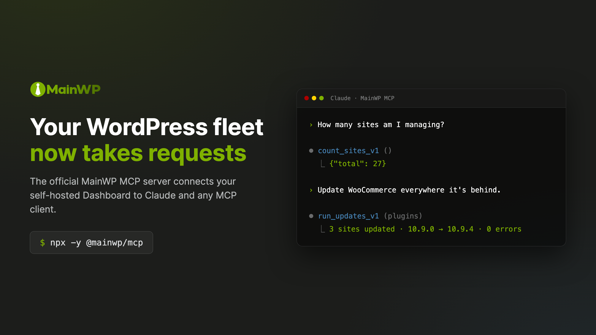

<p align="center">
  
</p>

<p align="center">
  
  <a href="https://www.npmjs.com/package/@mainwp/mcp"></a>
  <a href="https://github.com/mainwp/mainwp-mcp/actions/workflows/ci.yml"></a>
</p>

# MainWP MCP Server

_A [MainWP Labs](https://mainwp.com/mainwp-labs/) project, powered by MainWP_

Manage your whole WordPress network by talking to your AI assistant. [MainWP MCP Server](https://github.com/mainwp/mainwp-mcp) connects Claude, Cursor, OpenAI Codex, VS Code Copilot, and other MCP-compatible tools to your MainWP Dashboard, so you can ask in plain English:

> _"Which sites have pending plugin updates?"_
>
> _"Update WooCommerce everywhere it's behind."_
>
> _"Which client sites are disconnected right now?"_

The server is a small program that runs on your own computer, alongside your AI tool. Nothing new is installed on your Dashboard or your child sites. Your Dashboard stays in control: it exposes only the tools you allow, and by default anything classified as destructive stops for your confirmation before it runs.

<p align="center">
  
</p>

## What You Can Do

- **Site Management**: List sites, check connection status, sync data, add or remove child sites
- **Update Management**: See pending updates across all sites, apply core/plugin/theme updates
- **Plugin and Theme Control**: View installed plugins and themes, activate or deactivate them
- **Client Organization**: Manage client records, assign sites to clients, track costs
- **Bulk Operations**: Sync, reconnect, or check connectivity across dozens of sites at once

Built for WordPress agencies and site managers who want AI assistance with their MainWP workflows.

## Documentation

Full documentation lives at **[docs.mainwp.com/mcp-server](https://docs.mainwp.com/mcp-server/overview)**:

- [Quickstart](https://docs.mainwp.com/mcp-server/quickstart) with screenshots, if this is your first MCP server
- [Setup for every AI client](https://docs.mainwp.com/mcp-server/clients): Claude Desktop, Claude Code, Cursor, VS Code Copilot, OpenAI Codex, ZenCoder, and others
- [Safety & Permissions](https://docs.mainwp.com/mcp-server/safety): the confirmation flow, safe mode, and tool filtering
- [Prompt Cookbook](https://docs.mainwp.com/mcp-server/prompt-cookbook): ready-to-use prompts by task
- [Configuration Reference](https://docs.mainwp.com/mcp-server/reference/configuration) and [Troubleshooting](https://docs.mainwp.com/mcp-server/troubleshooting)

## Quick Start

**Requirements:** Node.js >=20.19.0 and MainWP Dashboard 6.0+

**1. Create an Application Password.** This is a separate password WordPress issues for tools like this one; it never changes your login and you can revoke it at any time.

1. Log into your MainWP Dashboard as an administrator
2. Go to **Users > Profile** (click your username in the top right)
3. Scroll to the **Application Passwords** section
4. Enter a name like "MainWP MCP Server" and click **Add New Application Password**
5. Copy the generated password immediately (it is only shown once; spaces are fine either way)

> **Tip:** Create a dedicated WordPress user for API access rather than using your main admin account. It keeps the audit trail clean and is easy to revoke later.

**2. Add the server to your AI tool.** For Claude Desktop and most other MCP clients, the config block looks like this:

```json
{
  "mcpServers": {
    "mainwp": {
      "command": "npx",
      "args": ["-y", "@mainwp/mcp"],
      "env": {
        "MAINWP_URL": "https://your-dashboard.com",
        "MAINWP_USER": "admin",
        "MAINWP_APP_PASSWORD": "xxxx xxxx xxxx xxxx xxxx xxxx"
      }
    }
  }
}
```

Config file locations and variants for each client are in the [client setup guide](https://docs.mainwp.com/mcp-server/clients). Prefer a central credentials file, or manage several Dashboards? See the [configuration reference](https://docs.mainwp.com/mcp-server/reference/configuration#configuration-file).

**3. Restart your AI tool and ask:** "List all my sites". A working setup returns your child sites by name and URL.

> **Start bounded.** You don't have to expose every tool on day one. Grant the smallest set your workflow needs and widen from there. See [Restrict Available Tools](https://docs.mainwp.com/mcp-server/guides/restrict-tools).

For development, clone and build instead of npx:

```bash
git clone https://github.com/mainwp/mainwp-mcp.git
cd mainwp-mcp
npm ci
npm run build
```

## Configuration

| Variable                           | Required       | Default    | Description                                                                                            |
| ---------------------------------- | -------------- | ---------- | ------------------------------------------------------------------------------------------------------ |
| `MAINWP_URL`                       | Yes            |            | Base URL of your MainWP Dashboard                                                                      |
| `MAINWP_USER`                      | For basic auth |            | WordPress admin username                                                                               |
| `MAINWP_APP_PASSWORD`              | For basic auth |            | WordPress Application Password                                                                         |
| `MAINWP_TOKEN`                     | No             |            | Compatibility only; the Abilities API is expected to reject bearer tokens. Use an Application Password |
| `MAINWP_SKIP_SSL_VERIFY`           | No             | `false`    | Skip SSL verification (dev only)                                                                       |
| `MAINWP_ALLOW_HTTP`                | No             | `false`    | Allow HTTP URLs (credentials sent in plain text)                                                       |
| `MAINWP_SAFE_MODE`                 | No             | `false`    | Block destructive operations                                                                           |
| `MAINWP_REQUIRE_USER_CONFIRMATION` | No             | `true`     | Require two-step confirmation for destructive operations                                               |
| `MAINWP_ALLOWED_TOOLS`             | No             |            | Whitelist of tools to expose                                                                           |
| `MAINWP_BLOCKED_TOOLS`             | No             |            | Blacklist of tools to hide                                                                             |
| `MAINWP_SCHEMA_VERBOSITY`          | No             | `standard` | `standard` or `compact`                                                                                |
| `MAINWP_RESPONSE_FORMAT`           | No             | `compact`  | Response JSON formatting: `compact` or `pretty`                                                        |
| `MAINWP_RATE_LIMIT`                | No             | `60`       | Maximum API requests per minute (`0` disables)                                                         |
| `MAINWP_REQUEST_TIMEOUT`           | No             | `30000`    | Request timeout in milliseconds                                                                        |
| `MAINWP_MAX_RESPONSE_SIZE`         | No             | `10485760` | Maximum single response size in bytes (10MB)                                                           |
| `MAINWP_MAX_SESSION_DATA`          | No             | `52428800` | Maximum cumulative session data in bytes (50MB)                                                        |
| `MAINWP_RETRY_ENABLED`             | No             | `true`     | Enable automatic retry for transient errors                                                            |
| `MAINWP_MAX_RETRIES`               | No             | `2`        | Total retry attempts including initial request                                                         |
| `MAINWP_RETRY_BASE_DELAY`          | No             | `1000`     | Base delay between retries in milliseconds                                                             |
| `MAINWP_RETRY_MAX_DELAY`           | No             | `2000`     | Maximum delay between retries in milliseconds                                                          |
| `MAINWP_ABILITY_NAMESPACES`        | No             | `mainwp`   | Comma-separated ability namespace allowlist                                                            |

> **⚠️ Security Warning: SSL Verification**
>
> Setting `MAINWP_SKIP_SSL_VERIFY=true` disables SSL certificate verification, making your connection vulnerable to man-in-the-middle (MITM) attacks. Only use for local development with self-signed certificates or isolated test environments. Never use in production or on untrusted networks.

Instead of environment variables, you can use a `settings.json` file in the working directory or `~/.config/mainwp-mcp/settings.json`; environment variables override file settings. Field names, the settings-to-variable mapping, and per-setting detail are in the [Configuration Reference](https://docs.mainwp.com/mcp-server/reference/configuration).

## Tools

Around 60 tools, organized by category (the exact count varies by Dashboard version):

| Category         | Tools | Reference                                                                                |
| ---------------- | ----- | ---------------------------------------------------------------------------------------- |
| Sites            | 30    | [Sites Abilities](https://docs.mainwp.com/api-reference/abilities-api/sites)             |
| Updates          | 13    | [Updates Abilities](https://docs.mainwp.com/api-reference/abilities-api/updates)         |
| Clients          | 11    | [Clients Abilities](https://docs.mainwp.com/api-reference/abilities-api/clients)         |
| Tags             | 7     | [Tags Abilities](https://docs.mainwp.com/api-reference/abilities-api/tags)               |
| Batch Operations | 1     | [Batch Operations](https://docs.mainwp.com/api-reference/abilities-api/batch-operations) |

Tool names drop the `mainwp/` namespace and use underscores: the ability `mainwp/list-sites-v1` is the tool `list_sites_v1`. Naming rules, the built-in MCP resources (`mainwp://abilities`, `mainwp://status`, and friends), and namespace prefixing for third-party abilities are covered in [Tools & Resources](https://docs.mainwp.com/mcp-server/reference/tools).

## Safety

Operations classified as destructive (the deletion tools, plus any ability that does not declare itself non-destructive) use a two-step flow by default: the server returns a preview and a one-time token, your AI shows you what will be affected, and only your explicit approval executes it. Disabling the flow (`MAINWP_REQUIRE_USER_CONFIRMATION=false`) removes that gate. Safe mode (`MAINWP_SAFE_MODE=true`) blocks destructive operations entirely, and tool filtering can remove them from the AI's view altogether. The full model, including what safe mode does and does not protect against, is on [Safety & Permissions](https://docs.mainwp.com/mcp-server/safety); the underlying trust and credential model is in the [Security Model](https://docs.mainwp.com/mcp-server/reference/security).

## Contributing

```bash
npm ci             # install dependencies
npm run dev        # run in watch mode
npm run inspect    # test with MCP Inspector
npm test           # run tests
npm run lint       # check code style
npm run format     # fix formatting
```

CI runs lint, format check, type check, tests, and build on every pull request.

When changing configuration options, update both the environment-variable table above and the [docs-site configuration reference](https://docs.mainwp.com/mcp-server/reference/configuration); they are maintained in parallel.

## License

GPL-3.0. See [LICENSE](LICENSE).
