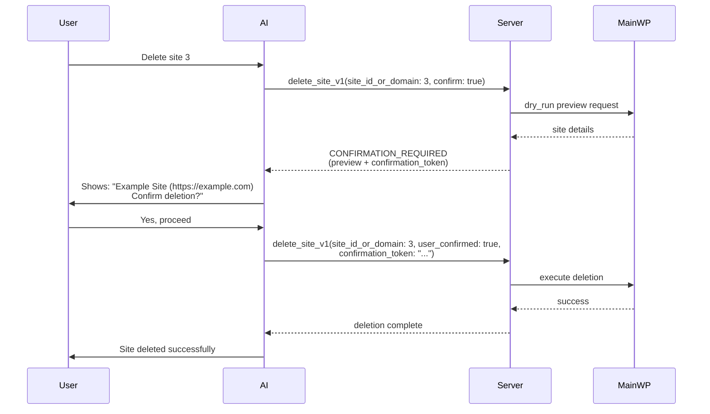

<p align="center">
  
</p>

<p align="center">
  
  <a href="https://www.npmjs.com/package/@mainwp/mcp"></a>
  <a href="https://github.com/mainwp/mainwp-mcp/actions/workflows/ci.yml"></a>
</p>

# MainWP MCP Server

_A [MainWP Labs](https://mainwp.com/mainwp-labs/) project, powered by MainWP_

**AI proposes the work. MainWP decides what's permitted, performs it, and reports what actually happened.**

[MainWP MCP Server](https://github.com/mainwp/mainwp-mcp) is for conversational AI management inside Claude, Cursor, or any MCP-compatible client.

**Looking for the MainWP Control CLI instead?** [MainWP Control](https://github.com/mainwp/mainwp-control) is a CLI for managing your MainWP Dashboard from the terminal. List sites, push updates, sync data, run batch operations across dozens of sites. MainWP Control is for automation: AI automation, cron jobs, CI/CD pipelines, monitoring scripts, and batch operations. Both talk to the same Abilities API with the same safety model.

**Beta Release** — This project is under active development. APIs may change between versions.

An MCP (Model Context Protocol) server that connects AI assistants to your MainWP Dashboard. This lets Cursor, Claude, OpenAI Codex, VS Code Copilot, and other AI tools manage your WordPress network through natural conversation.

## How It Works

MainWP MCP is a layered system, and each layer has a distinct job:

- **AI interprets intent.** The assistant turns a natural-language request into a plan and selects the tools that match it.
- **MCP applies the boundary.** The server exposes only the ability namespaces and tools you permit, and rechecks that policy when a tool is actually called, not just when tools are listed.
- **The MainWP Dashboard is the authority.** It holds your managed sites, defines the available abilities, and performs the WordPress operation.
- **You approve what matters.** Destructive operations stop at a confirmation gate before anything runs.

The AI stays flexible where flexibility helps. The Dashboard stays deterministic where consequences live.

## What You Can Do

- **Site Management**: List sites, check connection status, sync data, add or remove child sites
- **Update Management**: See pending updates across all sites, apply core/plugin/theme updates
- **Plugin and Theme Control**: View installed plugins and themes, activate or deactivate them
- **Client Organization**: Manage client records, assign sites to clients, track costs
- **Bulk Operations**: Sync, reconnect, or check connectivity across dozens of sites at once

Built for WordPress agencies and site managers who want AI assistance with their MainWP workflows.

> **Start bounded.** You don't have to expose every tool on day one. Grant the smallest set of abilities your workflow needs and widen from there. See [Limiting Exposed Tools](#limiting-exposed-tools).

---

## Quick Start

**Requirements:** Node.js >=20.19.0 and MainWP Dashboard 6.0+

### Option A: Run with npx (recommended)

No installation needed. Run the server directly:

```bash
npx -y @mainwp/mcp
```

Credentials are loaded from a `settings.json` file in either the current working directory or `~/.config/mainwp-mcp/settings.json`. See [Credential Configuration](#credential-configuration) for the file format.

### Option B: Clone and build (for development)

```bash
git clone https://github.com/mainwp/mainwp-mcp.git
cd mainwp-mcp
npm ci
npm run build
```

### Then:

1. Create an Application Password (see [instructions below](#creating-an-application-password))

2. Configure your AI tool (see [Installation](#installation))

3. Start chatting: "What sites need updates?" or "Sync all my sites"

Need inspiration? See the [Example Prompts](docs/example-prompts.md) for more ideas.

---

## Credential Configuration

There are two ways to provide your MainWP credentials. Both store credentials in config files, so choose based on your workflow preference.

### Option A: Per-Tool Configuration (Recommended)

Include credentials directly in each AI tool's MCP configuration using the `env` block. This is the standard approach you'll see in MCP server documentation.

```json
{
  "mcpServers": {
    "mainwp": {
      "command": "npx",
      "args": ["-y", "@mainwp/mcp"],
      "env": {
        "MAINWP_URL": "https://your-dashboard.com",
        "MAINWP_USER": "admin",
        "MAINWP_APP_PASSWORD": "xxxx xxxx xxxx xxxx xxxx xxxx"
      }
    }
  }
}
```

This is the standard approach. Each tool has its own self-contained config, and you can create a separate Application Password for each AI tool for better security.

### Option B: Centralized Settings File

Store your credentials once in `~/.config/mainwp-mcp/settings.json`:

```json
{
  "dashboardUrl": "https://your-dashboard.com",
  "username": "admin",
  "appPassword": "xxxx xxxx xxxx xxxx xxxx xxxx"
}
```

This keeps credentials in one place for all your AI tools. When you need to rotate passwords, you only update one file. You can also set restrictive permissions with `chmod 600` and safely share your MCP configs without exposing credentials.

If you manage multiple dashboards, this approach works well. The server checks the current working directory for `settings.json` first, so you can create separate folders for each dashboard and use the `cwd` option to point at them:

```json
{
  "mcpServers": {
    "mainwp": {
      "command": "npx",
      "args": ["-y", "@mainwp/mcp"],
      "cwd": "/path/to/dashboard-credentials"
    }
  }
}
```

Each folder just needs its own `settings.json` with that dashboard's credentials. To switch dashboards, change the `cwd` path or create multiple server entries with different names.

The downside is you have an extra file to manage, and all tools share the same password.

### Which Should I Use?

Use **Option A (per-tool configuration)** unless you have a specific reason not to. It's the standard approach, lets you use separate passwords per tool, and matches how other MCP servers work.

Use Option B if you use many AI tools and want to avoid duplicating credentials across configs.

> **Note:** Neither approach uses true system environment variables. For higher security options, see the [Security Guide](docs/security.md).

---

## Creating an Application Password

You'll need a [WordPress Application Password](https://make.wordpress.org/core/2020/11/05/application-passwords-integration-guide/) to connect to your MainWP Dashboard. Follow these steps to generate a WordPress Application Password to authenticate with your MainWP Dashboard.

1. Log into your MainWP Dashboard as an administrator
2. Go to **Users > Profile** in the WordPress portion (click your username in the top right of the MainWP Dashboard)
3. Scroll down to the **Application Passwords** section
4. Enter a name like "MainWP MCP Server"
5. Click **Add New Application Password**
6. Copy the generated password immediately (it's only shown once)

WordPress displays the password with spaces for readability. You can use it with or without the spaces.

> **Tip:** Create a dedicated WordPress user for API access rather than using your main admin account. This makes it easier to revoke access later if needed.

---

## Installation

Click on your AI tool to see configuration instructions.

<details>
<summary>Claude Code</summary>

Anthropic's official CLI for Claude with built-in MCP support.

**Add via CLI:**

```bash
claude mcp add --transport stdio mainwp \
  --env MAINWP_URL=https://your-dashboard.com \
  --env MAINWP_USER=admin \
  --env MAINWP_APP_PASSWORD="xxxx xxxx xxxx xxxx xxxx xxxx" \
  -- npx -y @mainwp/mcp
```

**Or add to `~/.claude.json`:**

```json
{
  "mcpServers": {
    "mainwp": {
      "command": "npx",
      "args": ["-y", "@mainwp/mcp"],
      "env": {
        "MAINWP_URL": "https://your-dashboard.com",
        "MAINWP_USER": "admin",
        "MAINWP_APP_PASSWORD": "xxxx xxxx xxxx xxxx xxxx xxxx"
      }
    }
  }
}
```

**Using settings.json instead:**

If you prefer centralized credentials, first create `~/.config/mainwp-mcp/settings.json` with your credentials, then simply run:

```bash
claude mcp add --transport stdio mainwp -- npx -y @mainwp/mcp
```

[Claude Code MCP Documentation](https://code.claude.com/docs/en/mcp)

</details>

<details>
<summary>Claude Desktop</summary>

The Claude desktop application for macOS and Windows.

Config file location:

- **macOS:** `~/Library/Application Support/Claude/claude_desktop_config.json`
- **Windows:** `%APPDATA%\Claude\claude_desktop_config.json`

```json
{
  "mcpServers": {
    "mainwp": {
      "command": "npx",
      "args": ["-y", "@mainwp/mcp"],
      "env": {
        "MAINWP_URL": "https://your-dashboard.com",
        "MAINWP_USER": "admin",
        "MAINWP_APP_PASSWORD": "xxxx xxxx xxxx xxxx xxxx xxxx"
      }
    }
  }
}
```

**Using settings.json instead:**

If you prefer centralized credentials, create `~/.config/mainwp-mcp/settings.json` with your credentials, then omit the `env` block:

```json
{
  "mcpServers": {
    "mainwp": {
      "command": "npx",
      "args": ["-y", "@mainwp/mcp"]
    }
  }
}
```

[Claude Desktop MCP Documentation](https://modelcontextprotocol.io/quickstart/user)

</details>

<details>
<summary>VS Code (Copilot Agent Mode)</summary>

GitHub Copilot in VS Code with MCP server support.

Add to `.vscode/mcp.json` in your workspace:

```json
{
  "servers": {
    "mainwp": {
      "type": "stdio",
      "command": "npx",
      "args": ["-y", "@mainwp/mcp"],
      "env": {
        "MAINWP_URL": "https://your-dashboard.com",
        "MAINWP_USER": "admin",
        "MAINWP_APP_PASSWORD": "xxxx xxxx xxxx xxxx xxxx xxxx"
      }
    }
  }
}
```

**Using secure input prompts:**

VS Code can prompt for credentials at runtime so they aren't stored in the file:

```json
{
  "inputs": [
    {
      "type": "promptString",
      "id": "mainwp_password",
      "description": "MainWP Application Password",
      "password": true
    }
  ],
  "servers": {
    "mainwp": {
      "type": "stdio",
      "command": "npx",
      "args": ["-y", "@mainwp/mcp"],
      "env": {
        "MAINWP_URL": "https://your-dashboard.com",
        "MAINWP_USER": "admin",
        "MAINWP_APP_PASSWORD": "${input:mainwp_password}"
      }
    }
  }
}
```

**Using settings.json instead:**

Create `~/.config/mainwp-mcp/settings.json` with your credentials, then omit the `env` block from your config.

[VS Code MCP Documentation](https://code.visualstudio.com/docs/copilot/chat/mcp-servers)

</details>

<details>
<summary>Cursor</summary>

The AI-first code editor with MCP support.

Config file: `.cursor/mcp.json` (project) or `~/.cursor/mcp.json` (global)

```json
{
  "mcpServers": {
    "mainwp": {
      "command": "npx",
      "args": ["-y", "@mainwp/mcp"],
      "env": {
        "MAINWP_URL": "https://your-dashboard.com",
        "MAINWP_USER": "admin",
        "MAINWP_APP_PASSWORD": "xxxx xxxx xxxx xxxx xxxx xxxx"
      }
    }
  }
}
```

Cursor also supports `${env:VAR_NAME}` to reference system environment variables.

**Using settings.json instead:**

Create `~/.config/mainwp-mcp/settings.json` with your credentials, then omit the `env` block from your config.

[Cursor MCP Documentation](https://cursor.com/docs/context/mcp)

</details>

<details>
<summary>OpenAI Codex</summary>

OpenAI's coding assistant with MCP support.

Config file: `~/.codex/config.toml` (uses TOML format, unlike the others)

```toml
[mcp_servers.mainwp]
command = "npx"
args = ["-y", "@mainwp/mcp"]

[mcp_servers.mainwp.env]
MAINWP_URL = "https://your-dashboard.com"
MAINWP_USER = "admin"
MAINWP_APP_PASSWORD = "xxxx xxxx xxxx xxxx xxxx xxxx"
```

**Using settings.json instead:**

Create `~/.config/mainwp-mcp/settings.json` with your credentials, then omit the `[mcp_servers.mainwp.env]` section from your config.

[OpenAI Codex MCP Documentation](https://developers.openai.com/codex/mcp)

</details>

<details>
<summary>ZenCoder</summary>

AI coding assistant for VS Code and JetBrains IDEs.

**VS Code:** Edit `zencoder.mcpServers` in VS Code settings.json:

```json
"zencoder.mcpServers": {
  "mainwp": {
    "command": "npx",
    "args": ["-y", "@mainwp/mcp"],
    "env": {
      "MAINWP_URL": "https://your-dashboard.com",
      "MAINWP_USER": "admin",
      "MAINWP_APP_PASSWORD": "xxxx xxxx xxxx xxxx xxxx xxxx"
    }
  }
}
```

**JetBrains:** Go to Settings > Tools > Zencoder > MCP Servers and use the same JSON format.

**Using settings.json instead:**

Create `~/.config/mainwp-mcp/settings.json` with your credentials, then omit the `env` block from your config.

[ZenCoder MCP Documentation](https://docs.zencoder.ai/features/integrations-and-mcp)

</details>

For Windsurf and other hosts, use the same JSON configuration pattern shown above.

---

## Configuration

### Environment Variables

| Variable                           | Required       | Default    | Description                                                                                            |
| ---------------------------------- | -------------- | ---------- | ------------------------------------------------------------------------------------------------------ |
| `MAINWP_URL`                       | Yes            |            | Base URL of your MainWP Dashboard                                                                      |
| `MAINWP_USER`                      | For basic auth |            | WordPress admin username                                                                               |
| `MAINWP_APP_PASSWORD`              | For basic auth |            | WordPress Application Password                                                                         |
| `MAINWP_TOKEN`                     | No             |            | Compatibility only; the Abilities API is expected to reject bearer tokens. Use an Application Password |
| `MAINWP_SKIP_SSL_VERIFY`           | No             | `false`    | Skip SSL verification (dev only)                                                                       |
| `MAINWP_ALLOW_HTTP`                | No             | `false`    | Allow HTTP URLs (credentials sent in plain text)                                                       |
| `MAINWP_SAFE_MODE`                 | No             | `false`    | Block destructive operations                                                                           |
| `MAINWP_REQUIRE_USER_CONFIRMATION` | No             | `true`     | Require two-step confirmation for destructive operations                                               |
| `MAINWP_ALLOWED_TOOLS`             | No             |            | Whitelist of tools to expose                                                                           |
| `MAINWP_BLOCKED_TOOLS`             | No             |            | Blacklist of tools to hide                                                                             |
| `MAINWP_SCHEMA_VERBOSITY`          | No             | `standard` | `standard` or `compact`                                                                                |
| `MAINWP_RESPONSE_FORMAT`           | No             | `compact`  | Response JSON formatting: `compact` or `pretty`                                                        |
| `MAINWP_RETRY_ENABLED`             | No             | `true`     | Enable automatic retry for transient errors                                                            |
| `MAINWP_MAX_RETRIES`               | No             | `2`        | Total retry attempts including initial request                                                         |
| `MAINWP_RETRY_BASE_DELAY`          | No             | `1000`     | Base delay between retries in milliseconds                                                             |
| `MAINWP_RETRY_MAX_DELAY`           | No             | `2000`     | Maximum delay between retries in milliseconds                                                          |
| `MAINWP_ABILITY_NAMESPACES`        | No             | `mainwp`   | Comma-separated ability namespace allowlist                                                            |

> **⚠️ Security Warning: SSL Verification**
>
> Setting `MAINWP_SKIP_SSL_VERIFY=true` disables SSL certificate verification, making your connection vulnerable to man-in-the-middle (MITM) attacks.
>
> **Only use for:** Local development with self-signed certificates or isolated test environments.
>
> **Never use in production** or on untrusted networks.

For the complete list of variables and configuration file options, see the [Configuration Guide](docs/configuration.md).

### Configuration File

Instead of environment variables, you can use a `settings.json` file:

```json
{
  "dashboardUrl": "https://your-dashboard.com",
  "username": "admin",
  "appPassword": "xxxx xxxx xxxx xxxx xxxx xxxx",
  "retryEnabled": true,
  "maxRetries": 2,
  "retryBaseDelay": 1000,
  "retryMaxDelay": 2000
}
```

Configuration loads from `./settings.json` or `~/.config/mainwp-mcp/settings.json` (checked in that order). Environment variables override file settings.

---

## Optimizing Token Usage

You have access to around 60 tools (the exact count varies by Dashboard version), which consume roughly 13,000 tokens in your AI's context window in standard mode (measured against a 62-tool catalog; actual counts vary by tokenizer). Two settings help reduce this footprint.

### Compact Schema Mode

A single setting reduces token usage by roughly 20% (about 13,000 → 10,000 tokens on the measured catalog):

```json
{
  "schemaVerbosity": "compact"
}
```

Or via environment variable:

```bash
MAINWP_SCHEMA_VERBOSITY=compact
```

Compact mode truncates descriptions to 60 characters and removes examples while leaving tool functionality unchanged.

### Limiting Exposed Tools

You can expose only the tools you need with `allowedTools`, or hide specific tools with `blockedTools`. For example, blocking the deletion tools while keeping everything else:

```json
{
  "blockedTools": [
    "delete_site_v1",
    "delete_client_v1",
    "delete_tag_v1",
    "delete_site_plugins_v1",
    "delete_site_themes_v1"
  ]
}
```

Tool names from non-primary namespaces (added via `abilityNamespaces`) use the `{namespace}__{tool}` form (e.g. `acme__do_thing_v1`), so reference them that way in `allowedTools` / `blockedTools`.

Filtering stacks with compact mode: a read-only monitoring preset cuts token usage by ~73%, and a focused four-tool automation config by over 90%. Ready-made presets (read-only monitoring, site management, updates only, minimal automation) live in the [Configuration Guide](docs/configuration.md#tool-filtering).

---

## Two-Step Confirmation Flow

Destructive operations (deletions) require your explicit confirmation to prevent accidental data loss. When you ask the AI to delete something, it shows you a preview first and waits for your approval.

### How It Works



**Example Conversation:**

```
You: Delete site 3

AI: I found site 3: Example Site (https://example.com)
    This will permanently remove it from your MainWP Dashboard.
    Do you want me to proceed with deletion?

You: Yes

AI: Site 3 has been deleted successfully.
```

### Affected Operations

These destructive tools require two-step confirmation:

- `delete_site_v1` - Delete a child site
- `delete_client_v1` - Delete a client record
- `delete_tag_v1` - Delete a tag
- `delete_site_plugins_v1` - Delete plugins from a site
- `delete_site_themes_v1` - Delete themes from a site

The gate is strict. Calling one of these tools with neither `confirm` nor `user_confirmed` returns a `PREVIEW_REQUIRED` error; the server never executes a bare destructive call. A confirmation must reference a preview of the same tool with the same arguments taken within the last 5 minutes. The preview response includes a `confirmation_token` the AI passes back with `user_confirmed: true`.

Abilities that require confirmation but don't support `dry_run` still go through the two-step gate: the server returns `CONFIRMATION_REQUIRED` with `preview: null` and a token, and the AI must describe the operation and get your explicit approval before confirming.

### Disabling for Automation

If you're running automated scripts that need to delete without interaction:

```json
{
  "requireUserConfirmation": false
}
```

Or as an environment variable:

```bash
MAINWP_REQUIRE_USER_CONFIRMATION=false
```

See the [Security Guide](docs/security.md#confirmation-guardrails) for more details.

---

## Tools

Around 60 tools organized by category (the exact count varies by Dashboard version). Each tool shows parameters with type, requirement, and description.

> **Note:** Tool names omit the primary namespace (default `mainwp`), so `mainwp/list-sites-v1` becomes `list_sites_v1`. If you add other namespaces via `abilityNamespaces`, abilities in those namespaces are exposed as `{namespace}__{tool}` (e.g. `acme/do-thing-v1` → `acme__do_thing_v1`). Keep `mainwp` in `abilityNamespaces` — the `mainwp://site/{id}` resource and the site ID prompt completions call `mainwp/get-site-v1` and `mainwp/list-sites-v1` directly and start returning errors or empty results if those abilities are filtered out.

<details>
<summary>Sites</summary>

- **list_sites_v1** - List MainWP child sites with pagination and filtering
  - `page`: Page number, 1-based (number, optional)
  - `per_page`: Items per page, max 100 (number, optional)
  - `status`: Filter by status: any, connected, disconnected, suspended (string, optional)
  - `search`: Search term for site name or URL (string, optional)
  - `client_id`: Filter by client ID (number, optional)
  - `tag_id`: Filter by tag ID (number, optional)

- **get_site_v1** - Get detailed information about a single site
  - `site_id_or_domain`: Site ID or domain/URL (string|number, required)
  - `include_stats`: Include update counts and health info (boolean, optional)

- **count_sites_v1** - Count total sites with optional filtering
  - `status`: Filter by status (string, optional)
  - `client_id`: Filter by client ID (number, optional)
  - `tag_ids`: Filter by tag IDs (number[], optional)

- **get_sites_basic_v1** - Get basic site info (id, url, name) for fast bulk retrieval
  - `page`: Page number (number, optional)
  - `per_page`: Items per page, max 100 (number, optional)
  - `status`: Filter by status (string, optional)
  - `client_id`: Filter by client ID (number, optional)
  - `tag_ids`: Filter by tag IDs (number[], optional)

- **sync_sites_v1** - Trigger synchronization for sites. Large operations queue automatically.
  - `site_ids_or_domains`: Sites to sync, empty array means all (array, optional)

- **add_site_v1** - Add a new child site to MainWP
  - `url`: Site URL (string, required)
  - `name`: Site name (string, required)
  - `admin_username`: Admin username on the child site (string, required)
  - `verify_certificate`: SSL verification: 0=off, 1=on, 2=global (number, optional)
  - `http_user`: HTTP auth username (string, optional)
  - `http_pass`: HTTP auth password (string, optional)
  - `tag_ids`: Tag IDs to assign (number[], optional)
  - `client_id`: Client ID to assign (number, optional)

- **update_site_v1** - Update settings for a child site
  - `site_id_or_domain`: Site ID or domain (string|number, required)
  - `name`: New site name (string, optional)
  - `url`: New site URL (string, optional)
  - `admin_username`: New admin username (string, optional)
  - `verify_certificate`: SSL verification setting (number, optional)
  - `suspended`: Suspended status: 0 or 1 (number, optional)
  - `tag_ids`: Tag IDs to assign (number[], optional)
  - `client_id`: Client ID to assign (number, optional)

- **delete_site_v1** - Delete a child site. Requires two-step confirmation: preview then user approval. [DESTRUCTIVE]
  - `site_id_or_domain`: Site ID or domain (string|number, required)
  - `confirm`: Must be true to request preview (boolean, required)
  - `dry_run`: Preview what would be deleted (boolean, optional)
  - `user_confirmed`: Set to true only after showing preview to user and receiving approval (boolean, optional)
  - `confirmation_token`: Token from the preview response; pass it back with `user_confirmed: true` (string, optional)

- **reconnect_site_v1** - Reconnect a disconnected site
  - `site_id_or_domain`: Site ID or domain (string|number, required)

- **disconnect_site_v1** - Disconnect a site
  - `site_id_or_domain`: Site ID or domain (string|number, required)

- **suspend_site_v1** - Suspend a site
  - `site_id_or_domain`: Site ID or domain (string|number, required)

- **unsuspend_site_v1** - Unsuspend a site
  - `site_id_or_domain`: Site ID or domain (string|number, required)

- **check_site_v1** - Check connectivity status of a site
  - `site_id_or_domain`: Site ID or domain (string|number, required)

- **reconnect_sites_v1** - Reconnect multiple sites. Large operations queue automatically.
  - `site_ids_or_domains`: Sites to reconnect (array, required)

- **disconnect_sites_v1** - Disconnect multiple sites. Large operations queue automatically.
  - `site_ids_or_domains`: Sites to disconnect (array, required)

- **check_sites_v1** - Check connectivity for multiple sites. Large operations queue automatically.
  - `site_ids_or_domains`: Sites to check (array, required)

- **suspend_sites_v1** - Suspend multiple sites. Large operations queue automatically.
  - `site_ids_or_domains`: Sites to suspend (array, required)

- **get_site_plugins_v1** - Get plugins installed on a site
  - `site_id_or_domain`: Site ID or domain (string|number, required)
  - `status`: Filter: all, active, inactive (string, optional)
  - `has_update`: Filter to plugins with updates (boolean, optional)

- **get_site_themes_v1** - Get themes installed on a site
  - `site_id_or_domain`: Site ID or domain (string|number, required)
  - `status`: Filter: all, active, inactive (string, optional)
  - `has_update`: Filter to themes with updates (boolean, optional)

- **activate_site_plugins_v1** - Activate plugins on a site
  - `site_id_or_domain`: Site ID or domain (string|number, required)
  - `plugins`: Plugin slugs to activate (string[], required)

- **deactivate_site_plugins_v1** - Deactivate plugins on a site
  - `site_id_or_domain`: Site ID or domain (string|number, required)
  - `plugins`: Plugin slugs to deactivate (string[], required)

- **delete_site_plugins_v1** - Delete plugins from a site. Requires two-step confirmation: preview then user approval. [DESTRUCTIVE]
  - `site_id_or_domain`: Site ID or domain (string|number, required)
  - `plugins`: Plugin slugs to delete (string[], required)
  - `confirm`: Must be true to request preview (boolean, required)
  - `dry_run`: Preview what would be deleted (boolean, optional)
  - `user_confirmed`: Set to true only after showing preview to user and receiving approval (boolean, optional)
  - `confirmation_token`: Token from the preview response; pass it back with `user_confirmed: true` (string, optional)

- **activate_site_theme_v1** - Activate a theme on a site
  - `site_id_or_domain`: Site ID or domain (string|number, required)
  - `theme`: Theme slug to activate (string, required)

- **delete_site_themes_v1** - Delete themes from a site. Requires two-step confirmation: preview then user approval. [DESTRUCTIVE]
  - `site_id_or_domain`: Site ID or domain (string|number, required)
  - `themes`: Theme slugs to delete (string[], required)
  - `confirm`: Must be true to request preview (boolean, required)
  - `dry_run`: Preview what would be deleted (boolean, optional)
  - `user_confirmed`: Set to true only after showing preview to user and receiving approval (boolean, optional)
  - `confirmation_token`: Token from the preview response; pass it back with `user_confirmed: true` (string, optional)

- **get_abandoned_plugins_v1** - Get abandoned plugins on a site
  - `site_id_or_domain`: Site ID or domain (string|number, required)

- **get_abandoned_themes_v1** - Get abandoned themes on a site
  - `site_id_or_domain`: Site ID or domain (string|number, required)

- **get_site_security_v1** - Get security status for a site
  - `site_id_or_domain`: Site ID or domain (string|number, required)

- **get_site_changes_v1** - Get non-MainWP changes detected on a site (requires Logs module)
  - `site_id_or_domain`: Site ID or domain (string|number, required)
  - `page`: Page number (number, optional)
  - `per_page`: Items per page, max 100 (number, optional)
  - `type`: Filter by change type (string, optional)

- **get_site_client_v1** - Get client assigned to a site
  - `site_id_or_domain`: Site ID or domain (string|number, required)

- **get_site_costs_v1** - Get costs for a site (requires Cost Tracker module)
  - `site_id_or_domain`: Site ID or domain (string|number, required)

</details>

<details>
<summary>Updates</summary>

- **list_updates_v1** - List available updates across sites
  - `page`: Page number (number, optional)
  - `per_page`: Items per page, max 200 (number, optional)
  - `site_ids_or_domains`: Filter to specific sites (array, optional)
  - `types`: Update types: core, plugins, themes, translations (string[], optional)

- **run_updates_v1** - Execute updates on sites. Large operations queue automatically.
  - `site_ids_or_domains`: Sites to update, empty means all with updates (array, optional)
  - `types`: Update types to apply (string[], optional)
  - `specific_items`: Specific slugs to update (string[], optional)

- **update_all_v1** - Execute ALL available updates across sites. Use with caution.
  - `site_ids_or_domains`: Sites to update, empty means all (array, optional)
  - `types`: Update types: core, plugins, themes, translations (string[], optional)

- **get_site_updates_v1** - Get available updates for a single site
  - `site_id_or_domain`: Site ID or domain (string|number, required)
  - `types`: Update types to retrieve (string[], optional)

- **update_site_core_v1** - Update WordPress core on a single site
  - `site_id_or_domain`: Site ID or domain (string|number, required)

- **update_site_plugins_v1** - Update plugins on a single site
  - `site_id_or_domain`: Site ID or domain (string|number, required)
  - `slugs`: Specific plugin slugs to update, empty means all (string[], optional)

- **update_site_themes_v1** - Update themes on a single site
  - `site_id_or_domain`: Site ID or domain (string|number, required)
  - `slugs`: Specific theme slugs to update, empty means all (string[], optional)

- **update_site_translations_v1** - Update translations on a single site
  - `site_id_or_domain`: Site ID or domain (string|number, required)
  - `slugs`: Specific translation slugs to update, empty means all (string[], optional)

- **list_ignored_updates_v1** - List updates marked as ignored
  - `site_ids_or_domains`: Filter to specific sites (array, optional)
  - `types`: Filter by type: core, plugins, themes (string[], optional)

- **set_ignored_updates_v1** - Add or remove items from ignored updates list
  - `action`: ignore or unignore (string, required)
  - `site_id_or_domain`: Site ID or domain (string|number, required)
  - `type`: Update type: core, plugin, theme (string, required)
  - `slug`: Item slug, use "wordpress" for core (string, required)

- **ignore_site_core_v1** - Ignore or unignore core updates for a site
  - `site_id_or_domain`: Site ID or domain (string|number, required)
  - `action`: add or remove from ignored list (string, optional)

- **ignore_site_plugins_v1** - Ignore or unignore plugin updates for a site
  - `site_id_or_domain`: Site ID or domain (string|number, required)
  - `slugs`: Plugin slugs to ignore/unignore (string[], required)
  - `action`: add or remove from ignored list (string, optional)

- **ignore_site_themes_v1** - Ignore or unignore theme updates for a site
  - `site_id_or_domain`: Site ID or domain (string|number, required)
  - `slugs`: Theme slugs to ignore/unignore (string[], required)
  - `action`: add or remove from ignored list (string, optional)

</details>

<details>
<summary>Clients</summary>

- **list_clients_v1** - List MainWP clients
  - `page`: Page number (number, optional)
  - `per_page`: Items per page, max 100 (number, optional)
  - `status`: Filter: any, active, suspended (string, optional)
  - `search`: Search term (string, optional)
  - `include`: Client IDs to include (number[], optional)
  - `exclude`: Client IDs to exclude (number[], optional)

- **count_clients_v1** - Count total clients
  - No parameters

- **get_client_v1** - Get detailed information about a client
  - `client_id_or_email`: Client ID or email (string|number, required)

- **add_client_v1** - Create a new client
  - `name`: Client name (string, required)
  - `client_email`: Email address (string, optional)
  - `client_phone`: Phone number (string, optional)
  - `address_1`: Address line 1 (string, optional)
  - `address_2`: Address line 2 (string, optional)
  - `city`: City (string, optional)
  - `state`: State/province (string, optional)
  - `zip`: Postal code (string, optional)
  - `country`: Country (string, optional)
  - `note`: Notes (string, optional)
  - `selected_sites`: Site IDs to assign (number[], optional)
  - `client_facebook`: Facebook URL (string, optional)
  - `client_twitter`: Twitter URL (string, optional)
  - `client_instagram`: Instagram URL (string, optional)
  - `client_linkedin`: LinkedIn URL (string, optional)

- **update_client_v1** - Update an existing client
  - `client_id_or_email`: Client ID or email (string|number, required)
  - `name`: Client name (string, optional)
  - `client_email`: Email address (string, optional)
  - `client_phone`: Phone number (string, optional)
  - `address_1`: Address line 1 (string, optional)
  - `address_2`: Address line 2 (string, optional)
  - `city`: City (string, optional)
  - `state`: State/province (string, optional)
  - `zip`: Postal code (string, optional)
  - `country`: Country (string, optional)
  - `note`: Notes (string, optional)
  - `selected_sites`: Site IDs to assign (number[], optional)

- **delete_client_v1** - Delete a client. Requires two-step confirmation: preview then user approval. [DESTRUCTIVE]
  - `client_id_or_email`: Client ID or email (string|number, required)
  - `confirm`: Must be true to request preview (boolean, required)
  - `dry_run`: Preview what would be deleted (boolean, optional)
  - `user_confirmed`: Set to true only after showing preview to user and receiving approval (boolean, optional)
  - `confirmation_token`: Token from the preview response; pass it back with `user_confirmed: true` (string, optional)

- **suspend_client_v1** - Suspend a client
  - `client_id_or_email`: Client ID or email (string|number, required)

- **unsuspend_client_v1** - Unsuspend a client
  - `client_id_or_email`: Client ID or email (string|number, required)

- **get_client_sites_v1** - Get sites associated with a client
  - `client_id_or_email`: Client ID or email (string|number, required)

- **count_client_sites_v1** - Count sites for a client
  - `client_id_or_email`: Client ID or email (string|number, required)

- **get_client_costs_v1** - Get costs for a client (requires Cost Tracker module)
  - `client_id_or_email`: Client ID or email (string|number, required)

</details>

<details>
<summary>Tags</summary>

- **list_tags_v1** - List MainWP tags
  - `page`: Page number (number, optional)
  - `per_page`: Items per page, max 100 (number, optional)
  - `search`: Search term (string, optional)
  - `include`: Tag IDs to include (number[], optional)
  - `exclude`: Tag IDs to exclude (number[], optional)

- **get_tag_v1** - Get detailed information about a tag
  - `tag_id`: Tag ID (number, required)

- **add_tag_v1** - Create a new tag
  - `name`: Tag name (string, required)
  - `color`: Tag color in hex format, e.g., #3498db (string, optional)

- **update_tag_v1** - Update an existing tag
  - `tag_id`: Tag ID (number, required)
  - `name`: Tag name (string, optional)
  - `color`: Tag color in hex format (string, optional)

- **delete_tag_v1** - Delete a tag. Requires two-step confirmation: preview then user approval. [DESTRUCTIVE]
  - `tag_id`: Tag ID (number, required)
  - `confirm`: Must be true to request preview (boolean, required)
  - `dry_run`: Preview what would be deleted (boolean, optional)
  - `user_confirmed`: Set to true only after showing preview to user and receiving approval (boolean, optional)
  - `confirmation_token`: Token from the preview response; pass it back with `user_confirmed: true` (string, optional)

- **get_tag_sites_v1** - Get sites associated with a tag
  - `tag_id`: Tag ID (number, required)
  - `page`: Page number (number, optional)
  - `per_page`: Items per page, max 100 (number, optional)

- **get_tag_clients_v1** - Get clients associated with a tag
  - `tag_id`: Tag ID (number, required)
  - `page`: Page number (number, optional)
  - `per_page`: Items per page, max 100 (number, optional)

</details>

<details>
<summary>Batch Operations</summary>

- **get_batch_job_status_v1** - Get status of a queued batch operation
  - `job_id`: Job ID from queued operation (string, required)

Operations with more than 50 sites are automatically queued for background processing. The response includes a `job_id` that you can use with this tool to check progress.

</details>

---

## Resources

These resources are available for inspection:

| URI                              | Description                                   |
| -------------------------------- | --------------------------------------------- |
| `mainwp://abilities`             | Full list of available abilities with schemas |
| `mainwp://categories`            | List of ability categories                    |
| `mainwp://status`                | Current connection status                     |
| `mainwp://help`                  | Tool documentation and safety conventions     |
| `mainwp://site/{site_id}`        | Details for a single site by ID               |
| `mainwp://help/tool/{tool_name}` | Documentation for a specific tool             |

---

## Documentation

- **[Configuration Reference](docs/configuration.md)** - All settings, tool filtering, safe mode
- **[Security Guide](docs/security.md)** - Trust model, credential management, best practices
- **[Example Prompts](docs/example-prompts.md)** - Sample queries to get started
- **[Troubleshooting](docs/troubleshooting.md)** - Common issues and solutions

---

## Contributing

```bash
npm run dev        # Development mode with hot reload
npm run inspect    # Test with MCP Inspector
npm test           # Run tests
npm run lint       # Check code style
npm run format     # Format code
```

CI runs on all pull requests and pushes to main.

---

## License

GPL-3.0
