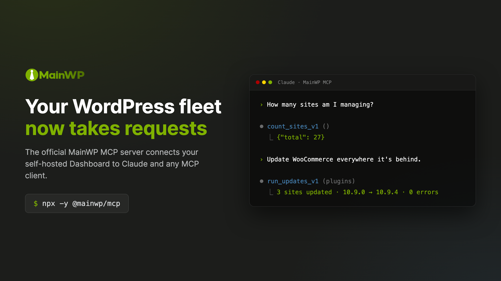

<p align="center">
  
</p>

<p align="center">
  <strong>Manage your whole WordPress network by talking to your AI assistant.</strong>
</p>

<p align="center">
  <a href="https://mainwp.com/mainwp-tools/mainwp-mcp/">Website</a> ·
  <a href="https://docs.mainwp.com/mcp-server/overview">Documentation</a> ·
  <a href="https://docs.mainwp.com/mcp-server/quickstart">Quickstart</a> ·
  <a href="https://docs.mainwp.com/mcp-server/prompt-cookbook">Prompt Cookbook</a> ·
  <a href="https://www.youtube.com/watch?v=J3CIcbmImEQ">Video</a> ·
  <a href="https://community.mainwp.com/">Community</a> ·
  <a href="https://mainwpinvite.com/">Discord</a> ·
  <a href="https://mainwp.com/mainwp-support/">Support</a>
</p>

<p align="center">
  <a href="https://www.npmjs.com/package/@mainwp/mcp"></a>
  <a href="https://github.com/mainwp/mainwp-mcp/actions/workflows/ci.yml"></a>
  <a href="LICENSE"></a>
</p>

# Official MainWP MCP Server

The MainWP MCP Server connects Claude, Cursor, OpenAI Codex, VS Code Copilot, and other MCP-compatible AI tools to your MainWP Dashboard, so you can ask in plain English:

> _"Which sites have pending plugin updates?"_
>
> _"Update WooCommerce everywhere it's behind."_
>
> _"Which client sites are disconnected right now?"_
>
> _"Check what we know about this client's sites before you update anything."_

It runs on your own computer, next to your AI tool. Nothing new is installed on your Dashboard or your child sites.

<p align="center">
  
</p>

## You stay in control

- **Changes wait for your approval.** Deleting a site, plugin, or theme shows you a preview first and runs only after you say yes. On Dashboard 6.3 and later, updates work the same way. Update confirmation is coming in MainWP 6.3 but available now in the [Early Release program](https://mainwp.com/add-on/early-access/).
- **Safe mode** blocks destructive operations entirely while you get comfortable.
- **You choose the tools.** Allow and block lists decide which tools your AI can see at all.
- **Your credentials stay with you.** The server signs in with a WordPress Application Password that you can revoke at any time, and it talks only to your Dashboard.

How it all works: [Safety & Permissions](https://docs.mainwp.com/mcp-server/safety).

## What you can do

- **Sites:** list, sync, check connectivity, add, reconnect, or remove child sites
- **Updates:** see pending core, plugin, theme, and translation updates across the network, and apply them
- **Plugins and themes:** see what is installed, activate, deactivate, or delete
- **Clients and tags:** manage client records, assign sites, and track costs
- **Knowledge:** agency, client, and site notes, skills, and memories your AI reads before it works. Knowledge is coming in MainWP 6.3 but available now in the [Early Release program](https://mainwp.com/add-on/early-access/).
- **Guided workflows:** network summaries, site reports, security audits, and update plans

Around 70 tools in all, depending on your Dashboard version. See [Tools & Resources](https://docs.mainwp.com/mcp-server/reference/tools).

Built for WordPress agencies and site managers who want AI help with their MainWP work.

## Requirements

- Node.js 20.19 or later on the computer that runs your AI tool
- MainWP Dashboard 6.0 or later, reachable over HTTPS (some tools need a newer Dashboard; the [Quickstart](https://docs.mainwp.com/mcp-server/quickstart) lists which)
- An MCP-compatible AI client

## Get started

**1. Create an Application Password.** In your MainWP Dashboard, go to **Users > Profile > Application Passwords**, add one named "MainWP MCP Server", and copy it. It is separate from your login password, and you can revoke it at any time. A dedicated WordPress user for API access keeps the audit trail clean.

**2. Add the server to your AI tool.** For Claude Desktop and most other MCP clients:

```json
{
  "mcpServers": {
    "mainwp": {
      "command": "npx",
      "args": ["-y", "@mainwp/mcp"],
      "env": {
        "MAINWP_URL": "https://your-dashboard.com",
        "MAINWP_USER": "admin",
        "MAINWP_APP_PASSWORD": "xxxx xxxx xxxx xxxx xxxx xxxx"
      }
    }
  }
}
```

**3. Restart your AI tool and ask** "List all my sites". A working setup returns your child sites by name and URL.

Config file locations for each client are in the [client setup guide](https://docs.mainwp.com/mcp-server/clients). Every setting is in the [Configuration Reference](https://docs.mainwp.com/mcp-server/reference/configuration).

**Using Claude Code?** The plugin installs the server, an agent skill, and ten `/mainwp:*` workflow commands:

```text
/plugin marketplace add mainwp/mainwp-mcp
/plugin install mainwp@mainwp-mcp
```

Credentials still come from your environment. See [Claude Code plugin](https://docs.mainwp.com/mcp-server/claude-code-plugin).

## Documentation

Full documentation lives at **[docs.mainwp.com/mcp-server](https://docs.mainwp.com/mcp-server/overview)**:

- [Quickstart](https://docs.mainwp.com/mcp-server/quickstart), with screenshots, if this is your first MCP server
- [Client setup](https://docs.mainwp.com/mcp-server/clients) for Claude Desktop, Claude Code, Cursor, VS Code Copilot, OpenAI Codex, and others
- [Safety & Permissions](https://docs.mainwp.com/mcp-server/safety) and [Restrict Available Tools](https://docs.mainwp.com/mcp-server/guides/restrict-tools)
- [Prompt Cookbook](https://docs.mainwp.com/mcp-server/prompt-cookbook): ready-to-use prompts by task
- [Configuration Reference](https://docs.mainwp.com/mcp-server/reference/configuration), including setup from the chat when no credentials are configured
- [Tools & Resources](https://docs.mainwp.com/mcp-server/reference/tools), [Security Model](https://docs.mainwp.com/mcp-server/reference/security), and [Troubleshooting](https://docs.mainwp.com/mcp-server/troubleshooting)

## Community

- [MainWP Community](https://community.mainwp.com/) forum
- [Discord](https://mainwpinvite.com/)
- [MainWP Support](https://mainwp.com/mainwp-support/)

## Contributing

Bug reports and pull requests are welcome. Please report security issues privately as described in [SECURITY.md](SECURITY.md).

```bash
npm ci             # install dependencies
npm run dev        # run in watch mode
npm run inspect    # test with MCP Inspector
npm test           # run tests
npm run lint       # check code style
npm run format     # fix formatting
```

CI runs lint, format check, type check, tests, and build on every pull request. When you change a configuration option, update the [docs-site configuration reference](https://docs.mainwp.com/mcp-server/reference/configuration) in the same change. `.agents/skills/mainwp-dashboard` is the canonical copy of the agent skill; see [docs/plugin.md](docs/plugin.md).

## License

GPL-3.0. See [LICENSE](LICENSE).
